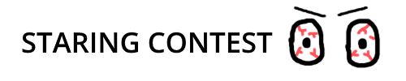

Stare at yourself using the power of computer vision! Have you ever been sitting alone and thought to yourself, "gee, if only there was a way that I could compete against myself in a staring contest!"? I know I have! 

This project was created for the 2021 [GunnHacks](https://www.gunnhacks.com/)
hackathon. 

You can download the game [***here***](https://github.com/TruuMoo/StaringContest/releases/tag/1.0).

## Screenshots


## Build
#### Dependencies
If you wish to build this project yourself, you must install [OpenCV](https://opencv.org/) and [SFML](https://www.sfml-dev.org/).
Personally, I recommend using [vcpkg](https://github.com/Microsoft/vcpkg) to install them both.

```bash
vcpkg install SFML
vcpkg install opencv:x64-windows
```

#### CMAKE

This project is built using [CMAKE](https://cmake.org/).
CMake may ask you for the locations of your dependency CMake Config files. If you install with vcpkg, those can be found here:
```
...vcpkg\installed\x64-windows\share\opencv
...vcpkg\installed\x64-windows\share\sfml
```
